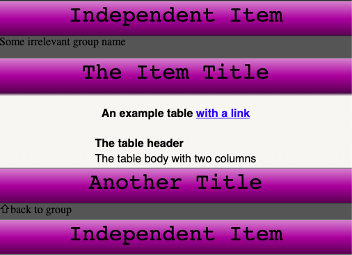

ex-panda
========


An Expanding List implemented as a vanilla WebComponent, inspired by another [ancient demo I wrote](https://jsfiddle.net/khrome/uggLM/).

Install
-------

    npm install ex-panda

Usage
-----

ex-panda consists of 3 tags: `<ex-panda-list>`, `<ex-panda-group>`, `<ex-panda-item>` which can be combined to make an expanding menu.

```html
    <style>
        ex-panda-list{
            color: #white;
            background-color: #990099 !important;
        }
        ex-panda-item{
            text-align: center;
            font-size: 2em;
            font-family: 'Courier'
        }
        ex-panda-item div, ex-panda-item table{ text-align: left }
        ex-panda-item > *{ font-size: 0.5em }
    </style>
    <div style="background-color: #990099">
        <ex-panda-list
            id="list-root"
            orientation="vertical"
        >
            <ex-panda-item name="Independent Item">
                <span>Stuff</span>
            </ex-panda-item>
            <ex-panda-group
                name="Some irrelevant group name"
                bg="#555555"
                threshold="1"
            >
                <ex-panda-item name="The Item Title">
                    <!-- Some HTML Tags -->
                </ex-panda-item>
                <ex-panda-item name="Another Title">
                    <span>Another Description</span>
                </ex-panda-item>
            </ex-panda-group>
            <ex-panda-item name="Independent Item">
                <span>Stuff</span>
            </ex-panda-item>
        </ex-panda-list>
    </div>
```

Will result in:


